# Google GenAI Cohort 2 - ADK Codelab Labs

My personal repository for the Google GenAI Academy APAC Cohort 2 Codelab. 

## Log & Updates

### 🧞 Session 1: Your First Agent with Runner

I successfully completed the setup and ran the first agent! Here is a simple explanation of what I did:

1. **Set up the starter repo**: Pulled the initial lab code from `cuppibla/ADK_Basic` to my local workspace.
2. **Environment Setup**: Created a Python 3.12 virtual environment and installed the google-adk library and other required dependencies.
3. **API Key Integration**: Created a root `.env` file and configured my Google AI Studio API key.
4. **Fixing the Quota Bug**: Originally the codebase was using `gemini-2.0-flash`, which was hitting a daily free quota limit. I upgraded the model definition in `a_single_agent/day_trip.py` to `gemini-2.5-flash` which is newer and has fresh free tier quota limits.
5. **Testing the Agent**: Fired up the local ADK web interface with `adk web` and created a fresh chat session. I asked the agent for a weekend trip to chill out around Bangalore in this hot summer. The agent used its built-in Google Search capability to construct a perfect, budget-aware day-trip suggestion to Chikmagalur (with precise coordinates and a details log).

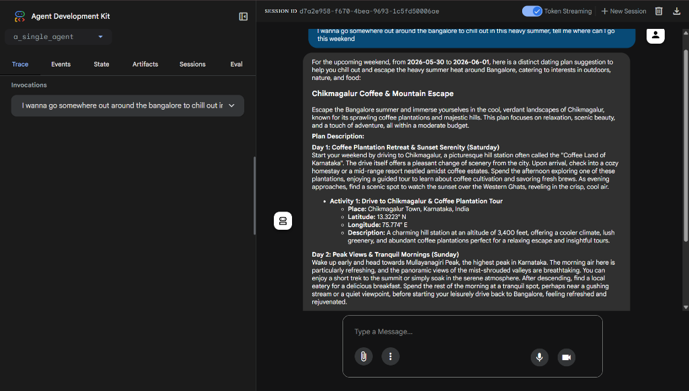

---

### 🛠️ Session 2: Custom Tools

I successfully built and integrated custom Python functions as tools inside the agent! Here is a simple explanation of what I did:

1. **Created Custom Python Tools**: Defined two custom Python functions (`save_user_preferences` and `recall_user_preferences`) that take `tool_context: ToolContext` to read/write state directly to the session memory.
2. **LLM Schema Generation**: Handled how the ADK parses custom function signatures and docstrings to automatically generate JSON schemas so the LLM knows how to call them.
3. **Equipped the Agent**: Bound these custom tools to the `MemoryCoordinatorAgent` under `f_agent_with_memory/agents.py`.
4. **Execution and State persistence**: Fired up the agent and told it my preferences: *"I love eating Hyderabadi biryani and watching movies"*. Behind the scenes, the agent successfully executed the `recall_user_preferences` tool, routed the request to a specialist planner to suggest **Bagara's - Hyderabadi Biryani** and **AMC Sunnyvale 12**, and then executed the `save_user_preferences` tool to write these new preferences directly to the SQLite session database.

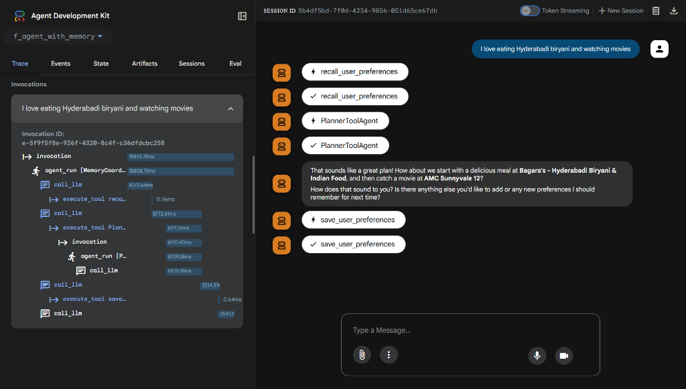

#### Persistent Session State & Tool Execution Details:
| Stored Preferences in sqlite DB | Tool Call Graph & JSON Response |
| :---: | :---: |
| 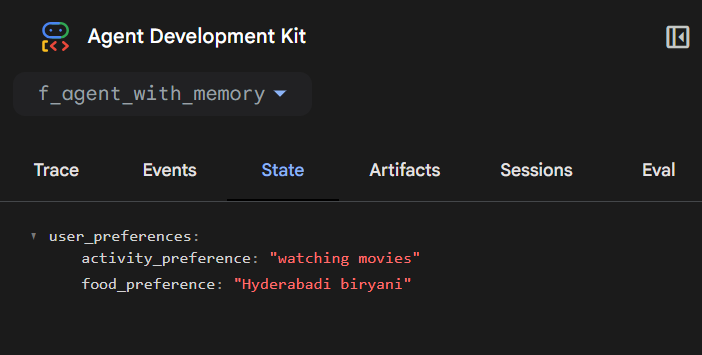 | 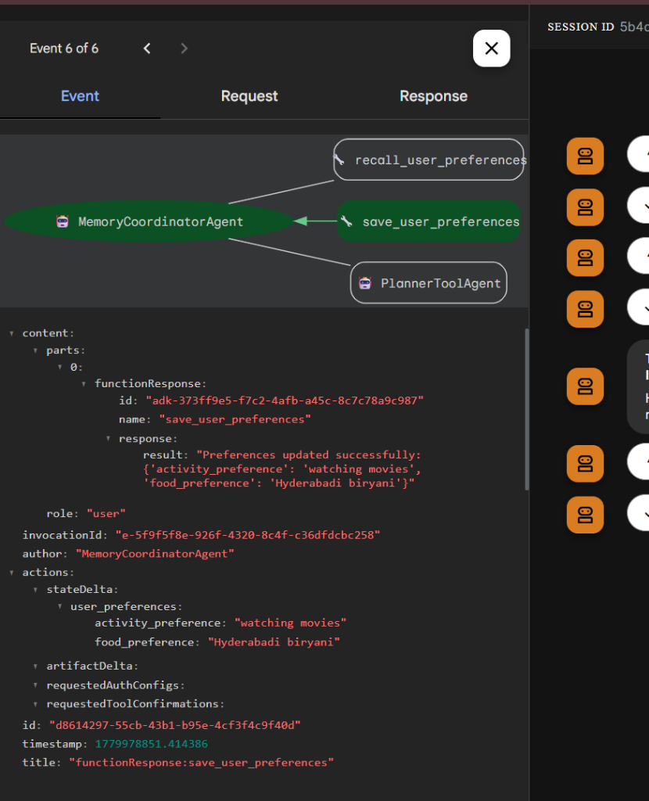 |

---

### 🧱 Session 3: Agent-as-a-Tool (Multi-Agent Architectures)

I successfully built and executed a hierarchical multi-agent orchestration system where agents use other specialized agents as tools! Here is a simple explanation of what I did:

1. **Created Specialized Specialist Agents**: Defined two expert sub-agents:
   - `LocationScoutAgent`: An expert finder tasked with finding specific venues matching a user query using Google Search and returning only its name.
   - `LogisticsValidatorAgent`: A travel coordinator designed to find travel times between points or retrieve operating hours.
2. **Built the Trip Architect (Orchestrator)**: Configured the root `TripArchitectAgent` and wrapped the specialized sub-agents inside `AgentTool` wrappers. The architect follows a self-correcting cognitive loop:
   - Deconstructs the user request, finds a primary activity, finds a meal venue, and calculates travel time.
   - **Self-Correction Loop**: If travel time exceeds 20 minutes, it automatically discards the venue, queries the scouts again for a closer restaurant, and outputs the final plan without user intervention.
3. **Execution & Trace Validation**:
   - Manually launched the server in my terminal and successfully connected to the local ADK Web UI.
   - Provided the prompt: *"I want to visit a technology museum and eat at a moderately priced South Indian restaurant in Jabalpur."*
   - Behind the scenes, the root agent dynamically spawned tool-calls to `LocationScoutAgent` (which discovered **AOC Museum** and **SSS Veg South Indian Restaurant**) and `LogisticsValidatorAgent` (which calculated a travel time of **15 minutes**).
   - The architect verified the travel time was within the 20-minute threshold and returned a completed, structured itinerary.

| Successful Multi-Agent Execution | Terminal Command Logs & Web Server |
| :---: | :---: |
| 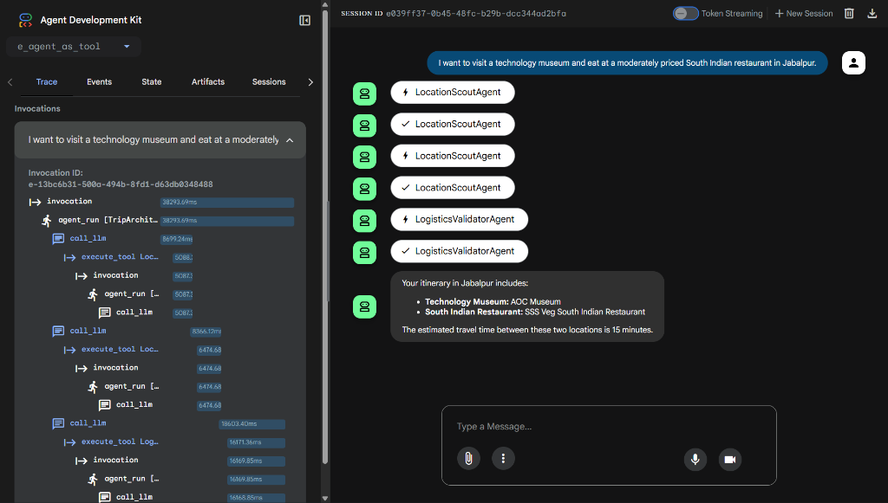 | 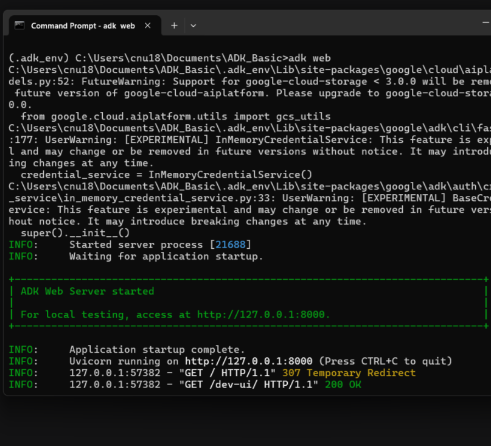 |

---

### ⛓️ Session 4: Sequential Chaining (Linear Workflows)

I successfully configured and executed a linear multi-agent workflow where agents communicate sequentially by sharing a persistent session state! Here is a simple explanation of what I did:

1. **Created Sub-Agent Roles**:
   - `foodie_agent`: Specialized in finding high-quality dining/venue suggestions. I configured it with `output_key="destination"` so its final response is automatically saved in the session's shared state under that key.
   - `transportation_agent`: Designed to act as a navigation helper. By using the `{destination}` placeholder in its instructions, it dynamically retrieves the destination from the session state and plans routes from the user's start location.
2. **Linear Pipeline Orchestration**: Grouped both agents under a `SequentialAgent` named `find_and_navigate_agent`. This ensures the first agent completely finishes and writes to state before the second agent starts.
3. **Execution & Trace Verification**:
   - Submitted the prompt: *"I am at Secundrabad railway station and I want to watch IPL at Uppal Stadium (Rajiv Gandhi International Cricket Stadium)."*
   - First, `foodie_agent` resolved the stadium as **Rajiv Gandhi International Cricket Stadium (Uppal Stadium)**.
   - Second, `transportation_agent` injected the stadium name, parsed "Secundrabad railway station" as the start, searched public transit details, and generated detailed routes (Hyderabad Metro Blue Line, bus, and taxi directions).
   - The trace logs successfully verified the clean, sequential execution flow.
| Initial Request (Secunderabad Station → Uppal Stadium) | Follow-up Contextual Request (Uppal Stadium → Chinese Food) |
| :---: | :---: |
| 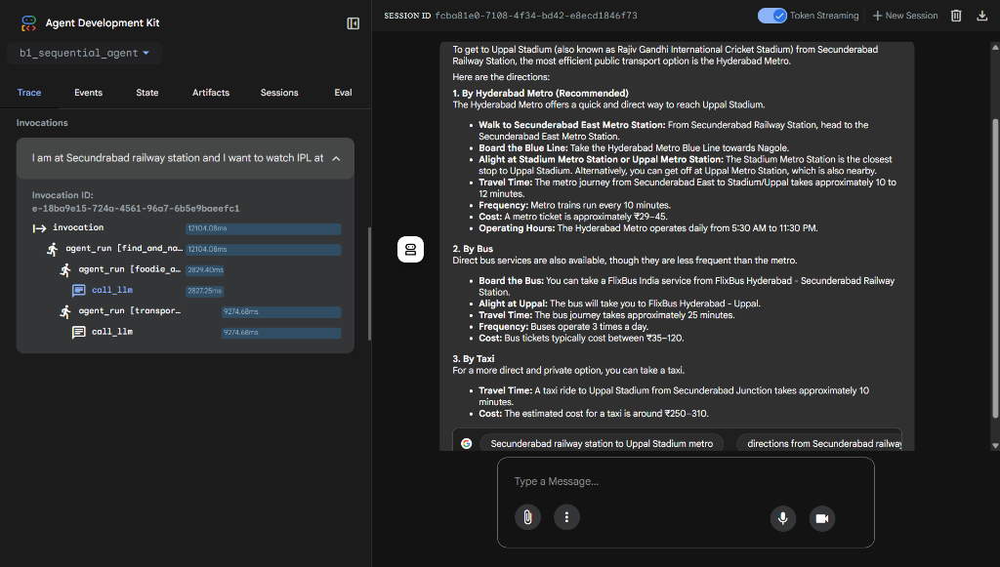 | 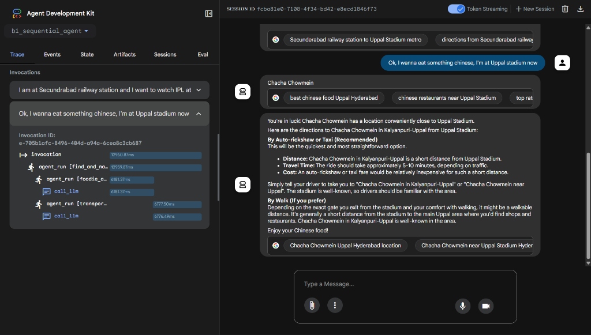 |

---

### 👯 Session 5: Parallel Research & Synthesis (Concurrence)

I successfully designed and ran a high-speed concurrent research workflow where multiple specialized agents executed simultaneously and synthesized their results! Here is a simple explanation of what I did:

1. **Created Parallel Specialist Sub-Agents**:
   - `museum_finder_agent`: Searches for a fitting museum and saves it to `museum_result`.
   - `concert_finder_agent`: Looks up active concert/band details and saves it to `concert_result`.
   - `restaurant_finder_agent`: Identifies top-rated restaurants and saves it to `restaurant_result`.
2. **Orchestrated Concurrent Operations**:
   - Wrapped the three researchers in a `ParallelAgent` container named `parallel_research_agent`. This triggers all three sub-agents at the exact same moment.
   - Chained it sequentially into a `synthesis_agent` that reads `{museum_result}`, `{concert_result}`, and `{restaurant_result}` from the shared session state to print a formatted bulleted overview.
3. **Execution & Trace Verification**:
   - Provided the request: *"I am visiting Bangalore this weekend. Find me a great art museum, an indie rock concert, and a top-rated cafe for breakfast."*
   - In parallel, the agents queried Google Search and resolved:
     - Museum: **National Gallery of Modern Art (NGMA) Bangalore**.
     - Concert: **Dark Light** (Bangalore progressive rock band).
     - Restaurant: **MTR (Mavalli Tiffin Rooms)**.
   - The coordinator consolidated these into an elegant recommendations list.
   - The trace logs confirmed the three search operations executed concurrently in parallel.

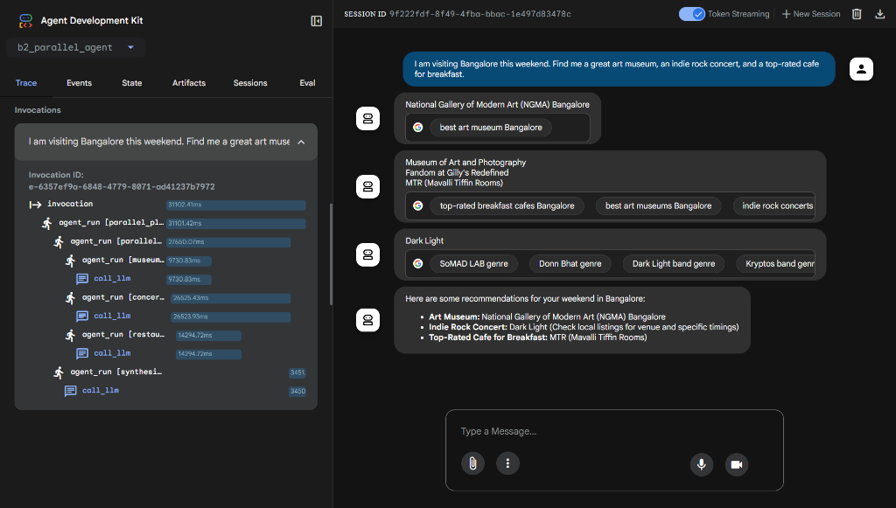

---

### 🔄 Session 6: Critique & Refinement Loops (Optimization)

I successfully built and validated an iterative critique-and-refinement multi-agent planning loop that optimizes plans dynamically based on constraints! Here is a simple explanation of what I did:

1. **Created Critique & Refinement Loop Roles**:
   - `planner_agent`: Generates the initial trip proposal containing one activity and one restaurant.
   - `critic_agent`: Evaluates the proposed venues using Google Search. If travel time exceeds 45 minutes, it issues a critique; otherwise, it outputs a feasibility approval phrase.
   - `refiner_agent`: Receives criticism and researches alternative nearby locations to overwrite the plan.
   - `exit_agent`: Monitors the validation state and triggers the custom Python tool `exit_loop` (setting `escalate = True`) to break the cycle when constraints are satisfied.
2. **Assembled Loop Logic**:
   - Grouped the critic, refiner, and exit agents inside a `LoopAgent` called `refinement_loop` with a maximum of 3 iterations.
   - Chained it sequentially after `planner_agent` in a root `iterative_planner_agent` container.
3. **Execution & Trace Verification**:
   - Submitted the prompt: *"Plan a trip in San Francisco where I visit a cool museum and eat dinner, but keep the travel time very short."*
   - In its first run, `planner_agent` suggested **Exploratorium** (Pier 15) and **La Mar Cebicheria Peruana** (Pier 1.5).
   - `critic_agent` calculated that the travel time is a simple **5-minute walk**, confirming the plan was fully optimized right away.
   - The loop controller caught the completion signal and triggered the custom `exit_loop` tool to exit immediately.
   - The nested trace graph verified the correct execution of the critique-refine cycle.

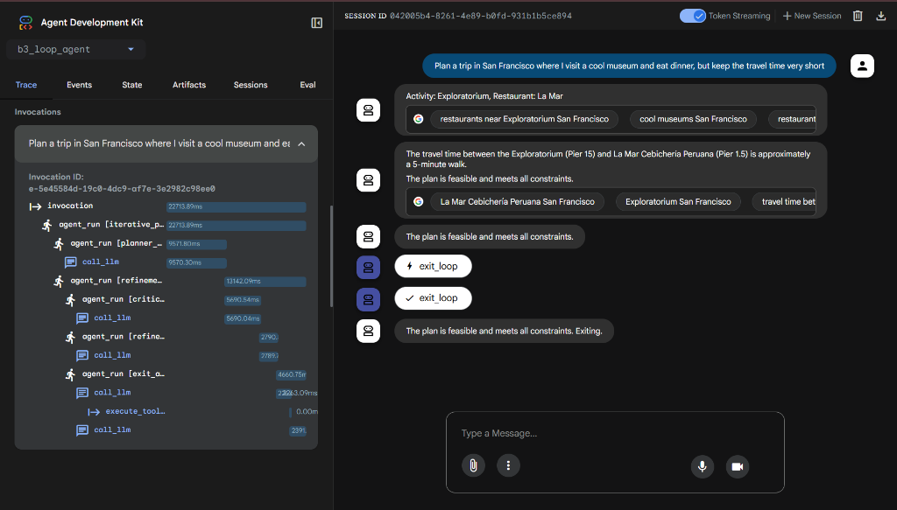

---

### 🛠️ Session 7: Custom Agents (Imperative Python Workflows)

I successfully designed, built, and executed a custom agent class in Python by inheriting from `BaseAgent`! This allowed me to write standard Python conditional gates, data sanitization, and budget-tracking loops to coordinate specialist LLM agents exactly like an imperative software application. Here is a simple explanation of what I did:

1. **Subclassed `BaseAgent`**: Created a custom `BudgetAwarePlannerAgent` class.
2. **Defined Sub-Agent Helpers**: Instantiated four dedicated helper sub-agents (`BudgetParserAgent`, `ActivityFinderAgent`, `CostEstimatorAgent`, `RestaurantFinderAgent`) inside the constructor.
3. **Wrote Custom Imperative Logic**: Inside `_run_async_impl`, I wrote standard Python code to control execution:
   - Parsed the numerical budget.
   - Discovered a Sunnyvale museum and estimated its ticket cost using search.
   - **Decision Gate 1 (Python)**: If the activity cost fits in the budget, it is added and a feedback agent is triggered.
   - Discovered a restaurant (averaging $35.00).
   - **Decision Gate 2 (Python)**: If the accumulated cost fits within the remaining budget, it is added.
   - Structured the successfully compiled items into a template and called a `SummaryAgent` to present the final plan.
4. **Execution & Trace Verification**:
   - Sent the prompt: *"I want to plan a fun day out in Sunnyvale. My total budget is $50."*
   - The budget parser successfully extracted `50`.
   - The agents found **Rosicrucian Egyptian Museum** ($15.00 ticket price) and **Dish Dash** restaurant ($35.00).
   - The Python code calculated the total cost ($15.00 + $35.00 = $50.00), verified it perfectly matched the budget threshold, and generated a formatted, template-compliant trip plan.
   - The trace logs successfully verified the execution order of all custom sub-agents.

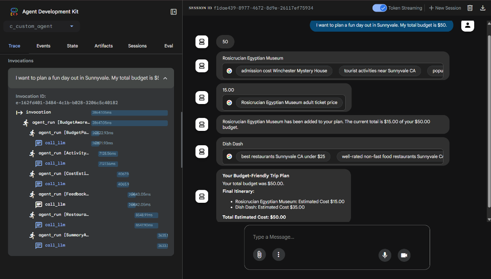

---

### 🚦 Session 8: Routing Agents (Dynamic Orchestration)

I successfully built and validated a dynamic travel coordinator using the Router Agent pattern! This master agent acts as the main gateway, dynamically analyzing user requests and routing them to the single best specialist agent or workflow from its team. Here is a simple explanation of what I did:

1. **Configured the Master Router**:
   - Assembled a team of specialist workflows (`iterative_planner_agent`, `parallel_planner_agent`, `BudgetAwarePlannerAgent`, `find_and_navigate_agent`, etc.) under the root `router_agent`.
   - Programmed decision-making logic: if budget is mentioned → route to `BudgetAwarePlannerAgent`; if distance optimization is requested → route to `iterative_planner_agent`; if diverse items are requested → route to `parallel_planner_agent`.
2. **Dynamic Routing & Execution**:
   - Prompted the router with a multi-criteria request in a new city: *"For my trip to Bangalore, find me a great art museum, an indie rock concert, and a top-rated cafe for breakfast."*
   - The router analyzed the query, matched the multiple diverse interests, and dynamically called the `transfer_to_agent` tool to dispatch the task to `parallel_planner_agent`.
   - The parallel agents executed simultaneously in Bangalore (discovering **NGMA**, the rock band **Dark Light**, and **Vidyarthi Bhavan**), and the synthesizer presented the perfect merged recommendations list.
3. **Trace Validation**:
   - Inspected the beautiful **Visual Architecture Trace Graph** displaying the complete hierarchical routing layout of our agent team.
   - The execution logs confirmed the router seamlessly transferred control and returned the finalized results.

| Complete Visual Architecture Trace Graph | Dynamic Routed Execution (Bangalore) |
| :---: | :---: |
| 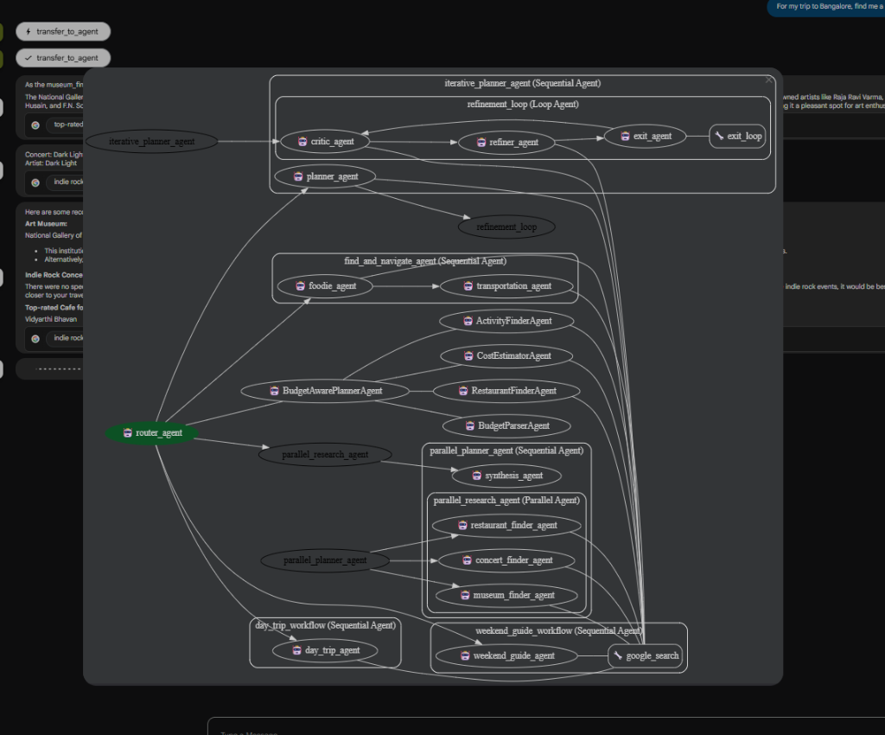 | 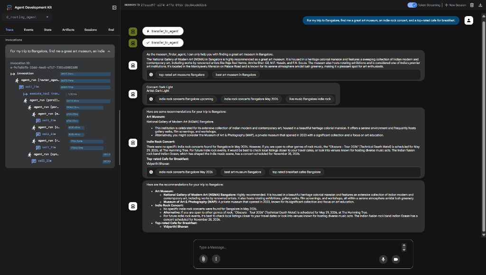 |

---

## Starter Resources
All the original labs, agent folders, and workflow setup files are included in this workspace.

- `a_single_agent/` - Basic agent configuration
- `b1_sequential_agent/` - SequentialAgent setup
- `b2_parallel_agent/` - ParallelAgent setup
- `b3_loop_agent/` - LoopAgent setup
- `b4_manual_sequential_flow/` - Manual routing and sequentially executing agents
- `c_custom_agent/` - Creating custom agent setups
- `d_routing_agent/` - Router agent setup
- `e_agent_as_tool/` - Agent-as-a-Tool implementation
- `f_agent_with_memory/` - Context-aware agent setup with conversational memory